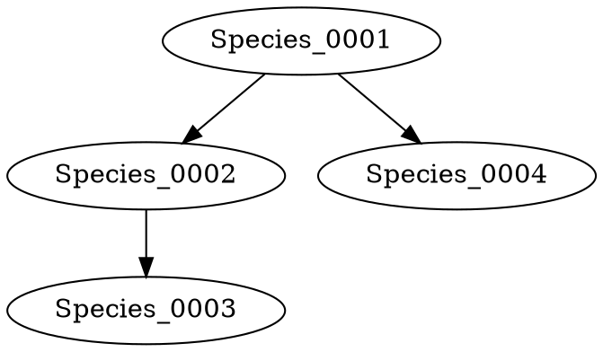

# Hexagonal Life Engine: Advanced Cells & Lineage Tracking

This update expands the biological complexity of the simulation by introducing specialized cell roles and a system to track the "Family Tree" of evolving species.

## 1. Advanced Cell Roles
The following cell types have been added to simulate more complex ecological niches:

| Cell Kind | Role | Behavioral Logic |
|-----------|------|------------------|
| **Virus** | Parasite | When adjacent to another organism, it has a chance to inject its genome, effectively converting the target into its own species. |
| **Scavenger** | Decomposer | Highly efficient food harvester. Unlike a standard Mouth, it consumes dead cells (Food) instantly for a large energy boost. |
| **Explosive** | Kamikaze | When the organism's health drops below 50%, this cell detonates, dealing massive damage to all organisms within a 2-hex radius. |

## 2. Lineage Tracking (The Family Tree)
The `FossilRecord` now stores the relationship between species. When a mutation creates a new species, the engine records its "Parent Species". This data can be exported in **DOT format**, allowing for visualization as a directed graph (Family Tree).

### Example Lineage Output

## 3. Neural-Driven Reproduction
The **Neural Brain** now has a dedicated output channel for **Reproduction**. An organism no longer reproduces automatically upon reaching an energy threshold; its brain must "decide" to trigger reproduction based on sensory inputs (e.g., when it detects high energy levels and a safe environment).

## 4. Ecological Impact
The introduction of the **Virus** cell creates a new survival pressure: organisms must evolve to avoid or kill viral species before they are "overwritten". The **Explosive** cell introduces a "mutual destruction" mechanic, where attacking an armored organism might result in a lethal counter-explosion.

---
### Technical Summary
- **Lineage Depth**: Unlimited tracking of species ancestry.
- **Viral Infection**: Probability-based genome overwriting.
- **Explosive Damage**: Area-of-effect damage centered on the explosive cell.
